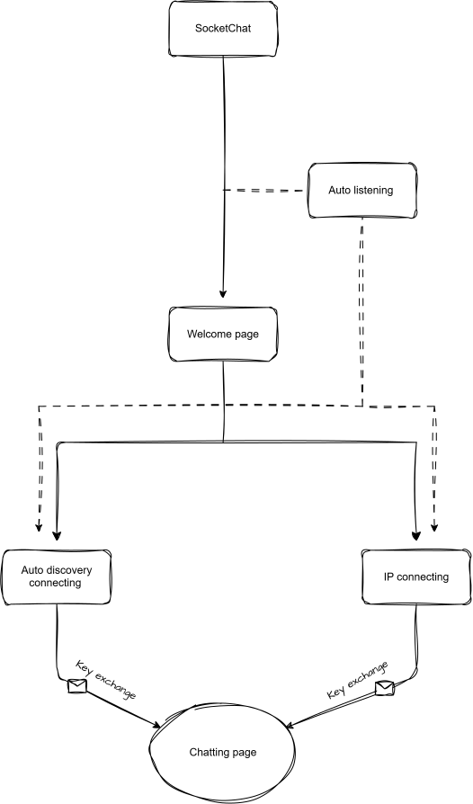
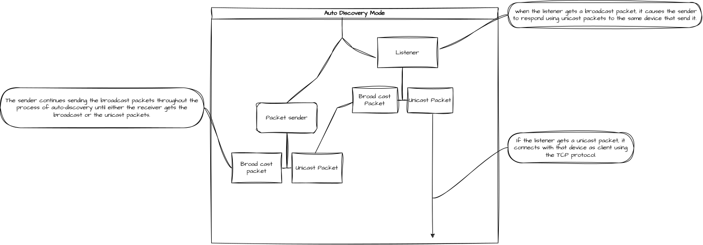

<div align="center">


<br>
 

[](LICENSE)
[](https://www.python.org/)


**SocketChat is a tool that allows you to chat with other devices on your LAN. Furthermore, it is supported with an auto-discovery system that discovers other devices running SocketChat in your LAN.**

[Why I build SocketChat](#why-i-build-socketchat) . [Key Features](#key-features) . [Installation & Quick start](#installation--quick-start) . [How SocketChat works](#how-socketchat-works)
<hr style="height:1px; border:none; background-color:#555;">

<br>


https://github.com/user-attachments/assets/bcd64317-a332-4557-959f-014ec942bf2d


<hr style="height:1px; border:none; background-color:#555;">
</div>


## Why I build SocketChat

Communicating with computers in the same network as you doesn't require the public internet.
Why do chatting tool require you to do all that unrelated stuff when
all you want to do is send a message to the computer on another floor or somewhere else on the same network?
It would be silly to try to send a message to a computer if you can't reach it over the public
internet, right?

So I created SocketChat to help with this. You can start it with the command `schat`.
To discover/connect with nearby devices on your LAN, type `/auto`, or to connect directly toa specific device,
type `/ip <the device's IP>`. Both methods use end-to-end encryption.
The tool runs a listener in the background, allowing you to see if other devices are running discovery mode in SocketChat in your LAN,
and you can choose to connect to or ignore them.

## Key Features

- **LAN only, no server.** All of your data is on your own network. No registration, no internet required.
- **Two modes of connecting.** Discover others on your LAN with `/auto`, or connect directly via `/ip 192.168.x.x` in case broadcasts are disabled.
- **Listening while you wait.** SocketChat listens in background when you run it, so that you will be notified whenever someone tries to contact you, you either accept or ignore them.
- **Per chat encryption.** Every chat generates new RSA-2048 keys which then encrypt your messages with AES-GCM. No keys are ever saved, they expire after every single chat.

## Installation & Quick start

> [!TIP]
> **Quick Start:** Install SocketChat via Docker to start using it easily.
### Installation using Docker (Recommended, Linux only)
**1. Get the installer**
```bash
curl -fsSL https://raw.githubusercontent.com/ALHANSHIM/SocketChat/main/installer.sh -o installer.sh
```
> [!NOTE]
> `installer.sh` just checks docker, pulls the image if you don't have it, and installs the `schat-docker` command.

**2. Run it, then start chatting**
```bash
bash installer.sh
schat-docker
```
### Clone the Repository & setting up 
**1. Clone the repo**
```bash
git clone https://github.com/ALHANSHIM/SocketChat.git
cd SocketChat
```

**2. Install required libraries**
```bash
pip install -r requirements.txt
```

**3. Install the `schat` command**
```bash
pip install -e .
```

That's it. From anywhere just type:
```bash
schat
```

> [!NOTE]
> **if pip complains on Linux with an `externally-managed-environment` error, just use a venv and run the install again:**


```bash
python3 -m venv myvenv
source myvenv/bin/activate
```
```bash
pip install -r requirements.txt
pip install -e .
```
---
## How SocketChat works 
### SocketChat running flow 
<div align="center">

</div>

The SocketChat application begins at the top level with only one starting point, which forks straight away. That is, the welcome page is displayed where the user interaction takes place alone while auto listening process goes in the background. You can follow either one of the two paths from the welcome page, namely auto discovering connection or IP connection; therefore, your choice forms the fork in the flow. The user interaction comes to an end right after that fork as both paths will be following the next stages independently, including key exchange, and reach the chatting page, which is the last point in the flow.
<br>

### Auto discovery mode 



Auto Discovery consists of only two components, which are packet sender and listener. The packet sender continually sends broadcast packets on the entire LAN network until the listener gets some response. In case when the listener receives a broadcast packet, it asks the packet sender to respond to this particular device using unicast packets. Then when the listener receives a unicast packet, it establishes the connection with the particular device in the role of TCP client.
